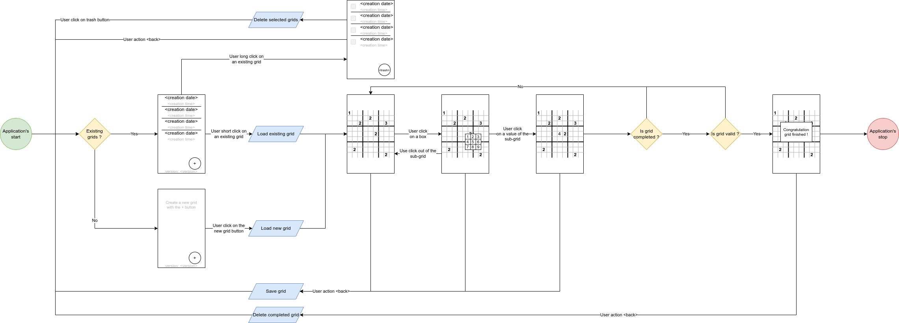

# Introduction
This Sudoku project is designed to be a facade of my current knowledges.
It won't only show my development's skills, but also how I consider a project must be defined, architectured, planned, and implemented from the first to the last brick.

During this development I will try to follow those steps:
1. Specifications
   1. Define user's UX and UI flows
   2. Focus on error cases and how to deal with it
2. Architecture
   1. Split the application in layers using the Clean Architecture (View, ViewModel, UseCase, Repository)
   2. Write the *simplified* UML and/or the UML
   3. Document technical limitations (when encountered) and solutions chosen
3. Planning
   1. Create a Sudoku *Project* which will serve as reference to the project's developer(s) and manager(s), to check its advancement
   2. Create a main *Epic* ticket which summarize the project's version features and developments
   3. Define functional testable *Feature*s tickets
   4. Split features into *Developments* tasks testable via unit and instrumented tests
4. Development
   1. Start the development following the plan, based on development tickets
   2. Adjust the plan from encountered issues
5. Improvement
   1. Restart the steps from the first's step with new features

Tools:
- [DrawIO](https://www.drawio.com/): for the UI/UX design, and the application's architecture
- [GitHub](https://github.com/): for code's versioning
- [GitHub Actions](https://docs.github.com/en/actions): for tests automation, releases management and other CI steps
- [Koin](https://insert-koin.io/): to manage dependency injection
- [Timber](https://github.com/JakeWharton/timber): for logging

---

# Specifications
This Android project allow a user to play the well known [Sudoku](https://fr.wikipedia.org/wiki/Sudoku) game.

After starting the application, the user will be able to see the list of his current games, or create a new one.
Each game will be visually referenced by its creation date and time.
On click on the creation button, a new Sudoku (partially filled) grid will be created and displayed to the user.
He will be able to select each empty case, and select one value between 1 and 9 (included).
Once the grid is fully filled, a test have to be done to ensure the grid is valid. If so the a popup showing a completion success to the user will be displayed.

A click on the back button will land the user on the games list after saving the user's grid, or deleting it if the grid was filled with success.

A long click on the games list will open checkboxes, near each game, allowing the user to select which game(s) must be deleted.
The creation icon will be replaced by a deletion icon. Once clicked, selected games will be deleted and the screen set back to its normal state.

