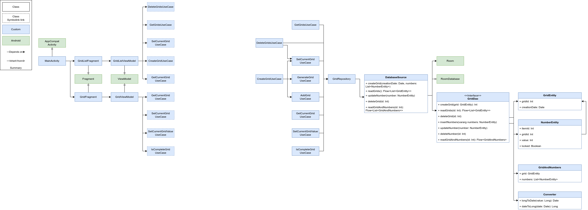

# Introduction
This Sudoku project is designed to be a facade of my current knowledges.
It won't only show my development's skills, but also how I consider a project must be defined, architectured, planned, and implemented from the first to the last brick.

During this development I will try to follow those steps:
1. Specifications
   1. Define user's UX and UI flows
   2. Focus on error cases and how to deal with it
2. Architecture
   1. Split the application in layers using the Clean Architecture
   2. Write the application's UML and database scheme
   3. Document technical limitations and solutions
3. Planning
   1. Create a Sudoku *Project* which will serve as reference, to the project's developer(s) and manager(s), to check its advancement
   2. Create a main *Epic* ticket which summarize the project's version, features and developments
   3. Define functional and testable *Feature*s tickets
   4. Split features into *Developments* tasks testable via unit and instrumented tests
4. Development
   1. Start the development following the plan, based on development tickets
   2. Adjust the plan from encountered issues
5. Improvement
   1. Iterate over the previous steps to add new features

Tools:
- [DrawIO](https://www.drawio.com/): for the UI/UX design, and the application's architecture
- [GitHub](https://github.com/): for code's versioning
- [GitHub Actions](https://docs.github.com/en/actions): for tests automation, releases management and other CI steps
- [Koin](https://insert-koin.io/): to manage dependency injection
- [Timber](https://github.com/JakeWharton/timber): for logging
- [Jira](https://www.atlassian.com/fr/software/jira): for project's management (features' split into developments and advancement)

---

# Specifications
This Android project allow a user to play the well known [Sudoku](https://fr.wikipedia.org/wiki/Sudoku) game.

After starting the application, the user will be able to see the list of his current games, or create a new one.
Each game will be visually referenced by its creation date and time.
On click on the creation button, a new Sudoku (partially filled) grid will be created and displayed to the user.
He will be able to select each empty case, and select one value between 1 and 9 (included).
Once the grid is fully filled, a test have to be done to ensure the grid is valid. If so the a popup showing a completion success to the user will be displayed.

A click on the back button will land the user on the games list after saving the user's grid, or deleting it if the grid was filled with success.

A long click on the games list will open checkboxes, near each game, allowing the user to select which game(s) must be deleted.
The creation icon will be replaced by a deletion icon. Once clicked, selected games will be deleted and the screen set back to its normal state.

*Functional requirements: UX flow*

# Architecture
We will start from an Android Compose default generated project.
The whole project architecture will be based on the [Clean-Architecture](https://medium.com/swlh/clean-architecture-in-android-a-beginner-approach-be0ce00d806b) pattern,
which mainly split the code into multiple layers:
- View: the Android' UI related classes:
  - Activity / Fragment
  - ViewModel
- UseCase: a set of small and functional classes containing the transformations required between the View and the Repository layer, in a unitary way.
- Repository: abstraction of data sources, which present the data without the complexity of database connection or creation.
It also ensure the data synchronization between its sources when there is more than one.
- Source: a real data source, which can be a remote (distant service over the network) or a local (database or file) one.

*Application's architecture: represented in a simplified UML way*

The application will be split in packages like the following:
- design: contain pure and/or reusable components split following the [Atomic Design](https://medium.com/@andkemal/atomic-design-a-modular-approach-to-ui-design-a93ad41c9b16)
  - atom
  - molecule
  - organism
  - templates
  - pages
- feature
  - gridlist
  - grid
- data

For now we have no need to split this into multiple [Android modules](https://developer.android.com/topic/modularization?hl=fr).
But by splitting the code into multiple packages it will be easier to do it later.

The SUML representation is quicker to write than a full UML.
In existing projects, where there isn't new dependencies or architecture, it helps to go the coding part without having to write details such as methods' names or returned type.
The developer mainly read the existing code to write the new one in the same style, and methods' name can be reviewed and changed during the code review.

When we start a new architecture, for a dedicated feature or on a technology change (from DataStore to Room database for instance), using a real UML can be better to avoid a lot of renaming and refactor which could be done during the review.
We can use both to clear some doubts.